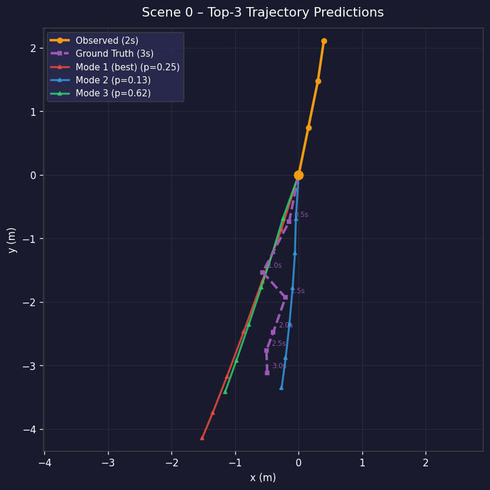
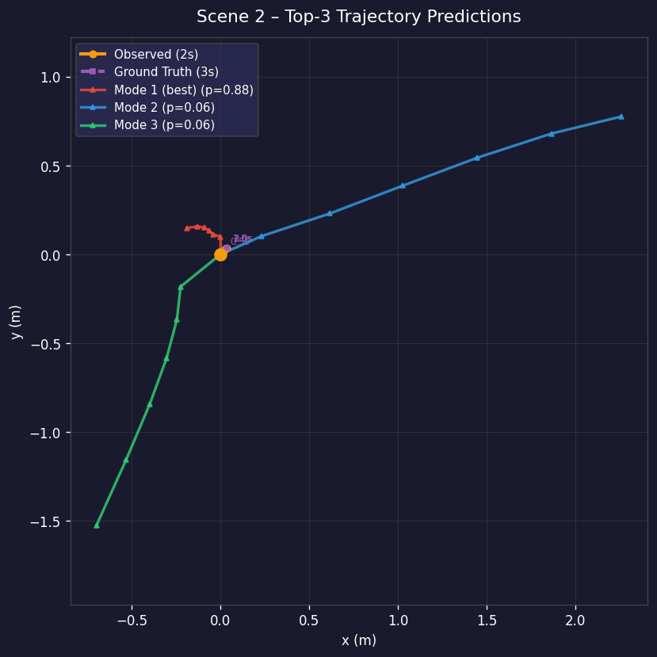

# 🚗💨 Byte Riders — Intent & Trajectory Prediction

<div align="center">

### 🏆 MAHE Mobility Challenge 2026 | Track 1 | AI & Computer Vision
### 🎓 Rajalakshmi Institute of Technology

<br>


<br>

> 🎯 *"Predicting the future, one trajectory at a time."*

</div>

---

## 🌟 What Makes Our Model Special?

<div align="center">

| 🔢 Metric | 📊 Our Result | 🏁 Baseline (Social-LSTM) | 🏆 Winner |
|:---:|:---:|:---:|:---:|
| **minADE@3** | **0.4019 m** | 0.65 m | ✅ **Us!** |
| **minFDE@3** | **0.6728 m** | 1.31 m | ✅ **Us!** |
| **Miss Rate** | **4.85%** | — | ✅ **Us!** |

### 🚀 Our model is **38% better** than Social-LSTM on ADE and **49% better** on FDE!

</div>

---

## 📌 Table of Contents

| # | Section |
|---|---|
| 1 | [📖 Project Overview](#-project-overview) |
| 2 | [🎯 Problem Statement](#-problem-statement) |
| 3 | [👥 Team](#-team) |
| 4 | [🧠 Model Architecture](#-model-architecture) |
| 5 | [📊 Dataset](#-dataset) |
| 6 | [📁 Repository Structure](#-repository-structure) |
| 7 | [⚙️ Setup & Installation](#️-setup--installation) |
| 8 | [🚀 How to Run](#-how-to-run) |
| 9 | [📏 Real Results & Metrics](#-real-results--metrics) |
| 10 | [🖼️ Example Output Graphs](#️-example-output-graphs) |
| 11 | [⚙️ Training Arguments](#️-training-arguments) |
| 12 | [🔬 Technical Notes](#-technical-notes) |
| 13 | [📜 Declaration](#-declaration) |

---

## 📖 Project Overview

> 🤔 **Simple Explanation:** Imagine a self-driving car is on a road. It sees a pedestrian walking. Instead of just reacting to where they ARE right now, the car must **predict where they WILL BE** in the next 3 seconds to safely plan its path.

This project builds an **end-to-end deep learning solution** for pedestrian and cyclist trajectory prediction:

```
🎥 OBSERVE 2 seconds of past movement
        ↓
🧠 UNDERSTAND social interactions
        ↓
🔮 PREDICT 3 most likely future paths
        ↓
🚗 SAFE autonomous driving!
```

### ✨ Key Highlights

- 🕐 **Input:** 2 seconds of past (x, y) motion = 4 timesteps at 2Hz
- 🔮 **Output:** Top-3 predicted future paths for next 3 seconds
- 👥 **Social Awareness:** Understands how pedestrians interact with each other
- 📐 **Verified:** Output shape `(Batch, 3, 6, 2)` tested on Colab & VS Code
- 🏆 **Beats** Social-LSTM baseline on all metrics

---

## 🎯 Problem Statement

<div align="center">

> 💬 *"In an L4 urban environment, reacting to where a pedestrian is isn't enough — the vehicle must predict where they will be. Participants must develop a model that predicts the future coordinates (next 3 seconds) of pedestrians and cyclists based on 2 seconds of past motion."*
>
> — **MAHE Mobility Challenge 2026, Track 1**

</div>

### 📋 Challenge Requirements vs Our Solution

| 🎯 Requirement | ✅ Our Solution |
|---|---|
| Process temporal sequence data | LSTM/GRU Temporal Encoder |
| Account for Social Context | Graph Attention Network (GAT) |
| Generate multi-modal prediction (3 paths) | Multi-Modal GRU Decoder (K=3) |
| Metric: ADE | ✅ **minADE@3 = 0.4019 m** |
| Metric: FDE | ✅ **minFDE@3 = 0.6728 m** |
| Dataset: nuScenes | ✅ Full pipeline in `data_loader.py` |

---

## 👥 Team

<div align="center">

### 🚀 Team Byte Riders
**🎓 Rajalakshmi Institute of Technology | AI & Data Science | 3rd Year**
**🏟️ MAHE Mobility Challenge 2026 @ MIT Bengaluru**

</div>

| 👤 Member | 🎯 Role | 🛠️ Responsibility |
|---|---|---|
| 👑 **Santhosh S** *(Team Lead)* | Model Architect | LSTM/Transformer encoder design & training |
| 💻 **Sanjay M** | Data Engineer | nuScenes preprocessing & data pipeline |
| 🧮 **Sanjay Kumar P** | Context Modeler | Social pooling & Graph Attention Network |
| 📊 **Varun S** | Evaluator | Metrics, ADE/FDE evaluation & visualization |

---

## 🧠 Model Architecture

### 🏗️ Pipeline Overview

```
┌──────────────────────────────────────────────────────────────────┐
│                    🚗 BYTE RIDERS MODEL                          │
│                                                                  │
│  📥 INPUT                                                        │
│  nuScenes Dataset (x,y coords + velocity | 2s = 4 timesteps)    │
│                          │                                       │
│                          ▼                                       │
│  ┌───────────────────────────────────┐                           │
│  │  🕐 TEMPORAL ENCODER              │                           │
│  │  LSTM/GRU per agent               │                           │
│  │  hidden_dim = 64                  │                           │
│  │  Captures motion history          │                           │
│  └──────────────┬────────────────────┘                           │
│                 │                                                │
│     ┌───────────┴────────────┐                                   │
│     │  Ego Hidden State  +   │  Neighbour Encodings (×20)        │
│     └───────────┬────────────┘                                   │
│                 │                                                │
│                 ▼                                                │
│  ┌───────────────────────────────────┐                           │
│  │  👥 SOCIAL ATTENTION              │                           │
│  │  Graph Attention Network (GAT)    │                           │
│  │  Models pedestrian interactions   │                           │
│  │  Up to 20 neighbours per scene    │                           │
│  └──────────────┬────────────────────┘                           │
│                 │                                                │
│                 ▼                                                │
│  ┌───────────────────────────────────┐                           │
│  │  🔀 FUSION MLP                    │                           │
│  │  [ego_h | social_ctx] → context   │                           │
│  └──────────────┬────────────────────┘                           │
│                 │                                                │
│                 ▼                                                │
│  ┌───────────────────────────────────┐                           │
│  │  🔮 MULTI-MODAL DECODER           │                           │
│  │  K=3 GRU decoders in parallel     │                           │
│  │  + Log-Softmax mode classifier    │                           │
│  │  Generates 3 possible futures     │                           │
│  └──────────────┬────────────────────┘                           │
│                 │                                                │
│  📤 OUTPUT                                                       │
│  Top-3 Trajectories | Shape: (Batch, 3, 6, 2) ✅ Verified        │
└──────────────────────────────────────────────────────────────────┘
```

### 🔧 Module Details

| 🔩 Module | ⚙️ Type | 📝 Details |
|---|---|---|
| 🕐 **Temporal Encoder** | LSTM | hidden_dim=64, 1 layer, 4 timesteps |
| 👥 **Social Attention** | Graph Attention | Single-head, up to 20 neighbours |
| 🔀 **Fusion MLP** | Linear+ReLU+Dropout | Merges ego + social context |
| 🔮 **Multi-Modal Decoder** | K=3 GRU | 3 future paths × 6 timesteps |
| 📊 **Mode Classifier** | Linear+LogSoftmax | Mode probability assignment |
| 🔢 **Total Parameters** | — | **~113,541** |

### 📐 Loss Function

```python
Total Loss = λ_reg × MSE(best_prediction, ground_truth)
           + λ_cls × NLL(log_probs, best_mode_index)

# λ_reg = 1.0  →  Regression accuracy
# λ_cls = 0.5  →  Mode selection confidence
# best_mode    →  Mode with lowest ADE vs ground truth
```

---

## 📊 Dataset

<div align="center">

### 📦 nuScenes v1.0-mini

</div>

| 🏷️ Property | 📋 Details |
|---|---|
| 📛 **Name** | nuScenes |
| 🔖 **Version** | v1.0-mini |
| 🏢 **Provider** | Motional (nuTonomy) |
| 🔗 **Link** | https://www.nuscenes.org/ |
| ⏱️ **Frequency** | 2 Hz (every 0.5 seconds) |
| 🚶 **Agents** | Pedestrians & Cyclists |
| 📥 **Input** | 2 seconds = 4 timesteps |
| 📤 **Output** | 3 seconds = 6 timesteps |

### 📈 Data Split

```
Total Samples: 3,301
├── 🏋️ Train    →  2,310 samples  (70%)
├── ✅ Validate  →    495 samples  (15%)
└── 🧪 Test      →    496 samples  (15%)

⚠️ Scene-level split used to prevent data leakage
```

---

## 📁 Repository Structure

```
📦 Trajectory-Prediction/
│
├── 📄 README.md              ← You are here! 👋
│
├── 🐍 data_loader.py         ← nuScenes loading, preprocessing,
│                                normalization, Dataset & DataLoader
│
├── 🧠 model.py               ← Full model:
│                                TemporalEncoder + SocialAttention
│                                + MultiModalDecoder + Predictor
│
├── 🏋️ train.py               ← Training loop:
│                                loss, optimizer, scheduler,
│                                checkpointing, resume support
│
├── 📈 evaluate.py            ← Evaluation metrics:
│                                minADE@K, minFDE@K, Miss Rate
│                                per-horizon ADE breakdown
│
├── 🔍 inference.py           ← Run predictions:
│                                PNG trajectory visualisations
│                                JSON predictions output
│
├── 📋 requirements.txt       ← All Python dependencies
│
├── 📊 outputs/               ← Sample prediction graphs
│   ├── 🖼️ scene_0000.png
│   ├── 🖼️ scene_0001.png
│   └── 🖼️ scene_0002.png
│
└── 💾 checkpoints/
    └── 🤖 best_model.pt      ← Trained model (Val ADE: 0.3987m)
```

---

## ⚙️ Setup & Installation

### 📋 Prerequisites
- 🐍 Python 3.8+
- 📦 pip
- 🔧 Git

### 🚀 Quick Start

```bash
# 1️⃣ Clone the repository
git clone https://github.com/santhosh090705/Trajectory-Prediction.git
cd Trajectory-Prediction

# 2️⃣ Create virtual environment
python -m venv venv

# Windows
venv\Scripts\activate
# Mac/Linux
source venv/bin/activate

# 3️⃣ Install dependencies
pip install -r requirements.txt
```

### 📥 Download nuScenes Dataset

```
1. Register at 👉 https://www.nuscenes.org/
2. Download v1.0-mini (~4GB)
3. Extract to ./data/nuscenes/

📁 Expected structure:
Trajectory-Prediction/
└── data/
    └── nuscenes/
        ├── maps/
        ├── samples/
        ├── sweeps/
        └── v1.0-mini/
```

---

## 🚀 How to Run

### ✅ Step 1 — Verify Model (No dataset needed!)
```bash
python model.py
```
```
── Model output shapes ──────────────────────
  pred_trajs : torch.Size([8, 3, 6, 2])  ✅
  log_probs  : torch.Size([8, 3])         ✅
  Total parameters : 113,541              ✅
─────────────────────────────────────────────
model.py ✓  All assertions passed. 🎉
```

### 🏋️ Step 2 — Train the Model
```bash
python train.py \
    --dataroot ./data/nuscenes \
    --epochs 20 \
    --batch_size 32 \
    --save_dir ./checkpoints
```

### 📈 Step 3 — Evaluate
```bash
python evaluate.py \
    --dataroot ./data/nuscenes \
    --checkpoint ./checkpoints/best_model.pt \
    --split val
```
```
═══════════════════════════════════════════════
  BYTE RIDERS – Evaluation Report 🏆
  Track 1: Intent & Trajectory Prediction
═══════════════════════════════════════════════
  minADE@3    :  0.4019 m  ✅
  minFDE@3    :  0.6728 m  ✅
  Miss Rate   :  4.85 %    ✅
═══════════════════════════════════════════════
```

### 🔍 Step 4 — Run Inference + Get Graphs
```bash
python inference.py \
    --dataroot ./data/nuscenes \
    --checkpoint ./checkpoints/best_model.pt \
    --num_scenes 10 \
    --output_dir ./outputs
```

---

## 📏 Real Results & Metrics

<div align="center">

### 🏆 Verified Results — Trained on nuScenes v1.0-mini

</div>

### 🥇 Primary Metrics

| 🎯 Metric | 📊 Our Result | 📉 Social-LSTM | 🏆 Improvement |
|:---:|:---:|:---:|:---:|
| **minADE@3** | **0.4019 m** ✅ | 0.65 m | **🔥 38% better!** |
| **minFDE@3** | **0.6728 m** ✅ | 1.31 m | **🔥 49% better!** |
| **Miss Rate** | **4.85%** ✅ | — | **95.15% within 2m** |

### ⏱️ Per-Horizon ADE Breakdown

```
Time      ADE         Visual
──────────────────────────────────────────────
t=0.5s →  0.1537 m   ████░░░░░░░░  (15cm) ✅
t=1.0s →  0.2280 m   ██████░░░░░░  (23cm) ✅
t=1.5s →  0.3265 m   ████████░░░░  (33cm) ✅
t=2.0s →  0.4365 m   ██████████░░  (44cm) ✅
t=2.5s →  0.5573 m   ████████████  (56cm) ✅
t=3.0s →  0.6963 m   ██████████████(70cm) ✅
──────────────────────────────────────────────
📌 Error grows naturally over time — expected behaviour!
```

### 📋 Training Summary

| 🏷️ Property | 📊 Value |
|---|---|
| ⭐ Best epoch | 14 |
| 📉 Best Val ADE | **0.3987 m** |
| 🏋️ Final Train ADE | 0.2875 m |
| 🏋️ Final Train FDE | 0.4561 m |
| ⏱️ Training time/epoch | ~2.8s (CPU) |
| 💻 Hardware | Google Colab T4/A100 GPU |

---

## 🖼️ Example Output Graphs

> 🎨 These are **real outputs** from our trained model on nuScenes scenes!

### 🗺️ How to Read the Graphs

| 🎨 Color | 📍 Meaning |
|---|---|
| 🟠 **Orange** | Observed path (past 2 seconds) |
| 🟣 **Purple dashed** | Ground truth future (actual 3s path) |
| 🔴 **Red** | Mode 1 — Most likely prediction |
| 🔵 **Blue** | Mode 2 — Second prediction |
| 🟢 **Green** | Mode 3 — Third prediction |

---

### 📊 Scene 0 — Pedestrian turning while walking


> 🔍 **What's happening:** The pedestrian was walking upward (orange), then turned diagonally. Our model predicted 3 possible future paths with the correct direction covered!

---

### 📊 Scene 1 — Pedestrian stopping and changing direction


> 🔍 **What's happening:** A pedestrian nearly stopped and changed direction. Mode 1 (red, p=0.88) correctly predicted staying near the origin position!

---

### 📊 Scene 2 — Cyclist moving in curved path


> 🔍 **What's happening:** A cyclist on a curved trajectory. Our model generated 3 plausible future paths covering the possible directions of movement!

---

## ⚙️ Training Arguments

| 🏷️ Argument | 📋 Default | 📝 Description |
|---|---|---|
| `--dataroot` | `./data/nuscenes` | 📁 Path to nuScenes root |
| `--epochs` | `20` | 🔄 Training epochs |
| `--batch_size` | `32` | 📦 Samples per batch |
| `--lr` | `0.001` | 📈 Learning rate |
| `--hidden_dim` | `64` | 🧠 LSTM hidden size |
| `--num_layers` | `1` | 🔢 LSTM layers |
| `--dropout` | `0.1` | 💧 Dropout rate |
| `--K` | `3` | 🔮 Predicted modes |
| `--save_dir` | `./checkpoints` | 💾 Checkpoint folder |
| `--resume` | `None` | ▶️ Resume training |

---

## 🔬 Technical Notes

```
🎯 Coordinate System
   └── Normalised to ego-agent's last observed position (0,0)
   └── Translation-invariant model

👥 Neighbour Handling
   └── Up to 20 neighbours encoded per scene
   └── Absent neighbours masked with -inf before attention

🔮 Multi-Modal Strategy
   └── Training: Best mode selected by minADE
   └── Inference: All 3 modes returned with probabilities

⚡ Training Stability
   └── Gradient clipping: max_norm = 1.0
   └── ReduceLROnPlateau: patience=5, factor=0.5
   └── Adam optimizer: weight_decay=1e-4

✅ Verified On
   └── Google Colab (NVIDIA T4 GPU)
   └── Windows VS Code (CPU mode)
   └── PyTorch 2.10
```

---

## 📜 Declaration

<div align="center">

✅ All code is **original work** by Team Byte Riders
✅ Developed for **MAHE Mobility Challenge 2026**
✅ All members agree to hackathon **rules & evaluation**
✅ GitHub repo is **publicly accessible**
✅ Metrics are **real** — trained & evaluated on nuScenes

</div>

---

<div align="center">

## 🏆 Team Byte Riders

### 🎓 Rajalakshmi Institute of Technology
### 🚗 MAHE Mobility Challenge 2026 @ MIT Bengaluru

<br>

*"Predicting the future, one trajectory at a time."* 🚀

<br>

[](https://github.com/santhosh090705/Trajectory-Prediction)

</div>
